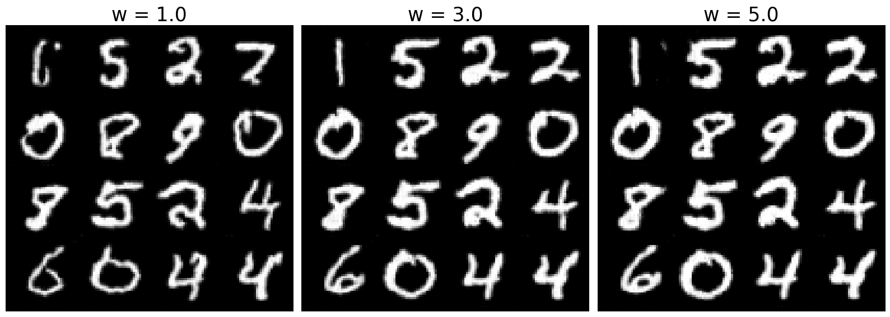

# Flow Model MNIST Image Generation

A minimal implementation of flow-based generative models for MNIST digit generation, featuring U-Net architecture and Classifier-Free Guidance sampling.

## Overview

This repository contains a Jupyter notebook implementing a flow matching model trained on the MNIST dataset. The project serves as a learning exercise for understanding the fundamentals of flow-based generative models and their practical implementation.

## Features

- **U-Net Architecture**: Custom implementation of U-Net for the flow model backbone
- **Flow Matching Training**: Implementation of flow matching loss and training procedure
- **Classifier-Free Guidance**: Enhanced sampling with classifier-free guidance for improved generation quality
- **MNIST Dataset**: Training and evaluation on the classic MNIST handwritten digits dataset

## Key Components

- Flow model implementation with U-Net architecture
- Training loop with flow matching objective
- Sampling procedures with and without classifier-free guidance
- Visualization utilities for generated samples


## Requirements

See `requirements.txt` for the complete list of dependencies.

## Usage

1. Clone the repository:
```bash
git clone https://github.com/TheHelltaker/MNIST_flow.git
cd MNIST_flow
```

2. Install dependencies:
```bash
pip install -r requirements.txt
```

3. Open and run the notebook:
```bash
jupyter notebook flow_model_mnist.ipynb
```

## Learning Objectives

This implementation helps understand:
- Flow matching theory and implementation
- U-Net architecture for generative modeling
- Classifier-free guidance for improved sampling
- Training dynamics of flow-based models
- Practical aspects of generative model development

## Acknowledgments

This project is heavily inspired by the excellent course:
**[Flow Matching and Diffusion Models](https://diffusion.csail.mit.edu/)** by MIT

The course provides comprehensive coverage of modern generative modeling techniques and serves as the theoretical foundation for this implementation.

## License

This project is for educational purposes. Please refer to the original course materials for their respective licensing terms.

## Note

This is a learning project and may not represent production-ready code. The implementation prioritizes clarity and educational value over optimization.